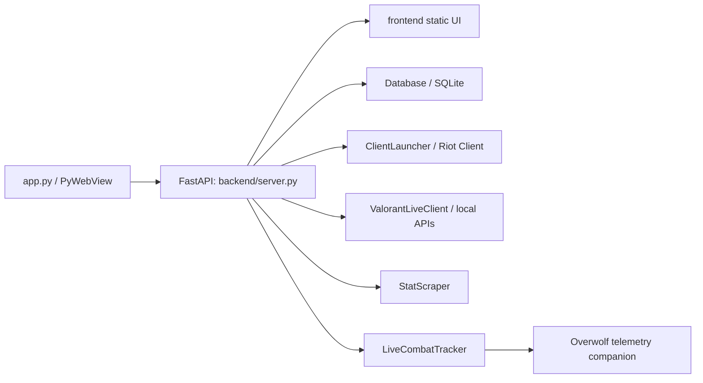

# Architecture

`app.py` is the executable entry point. It starts FastAPI on loopback and opens its URL in a native WebView. `backend/server.py` owns HTTP routes and static serving; business modules are imported from `backend/`.

The `Database` manages accounts, settings, SQLite migration, banned-account movement, and backups. Source runs keep data in the ignored repository-local SQLite file; frozen builds use `%LOCALAPPDATA%\\Vortex`.

The browser UI is intentionally static: `frontend/index.html` loads `app.js` and `styles.css`, and communicates with the backend via `/api`. The live overlay has its own HTML/CSS/JS trio.

Packaging is deliberately path-based. PyInstaller bundles `frontend/`; Inno Setup reads the staged bundle; the updater reads `version.json` and starts the installer. Keep those contracts aligned when touching source or assets.
