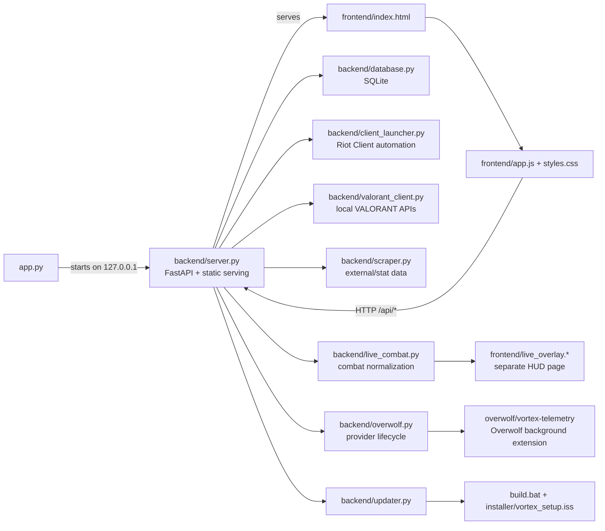

# Vortex repository structure

This document describes the repository as it exists on 2026-09-03 at commit
`a327807f` (`release: Vortex v5.5.42 — UI redesign + audit + Live Match authority`).
It is a human-oriented companion to the graphify artifacts in
`graphify-out/`.

## What the repository is

Vortex is a Windows desktop VALORANT account manager and rank/statistics
dashboard. It is a local application with three cooperating surfaces:

1. `app.py` starts the local FastAPI service and hosts the desktop window.
2. `backend/` owns persistence, HTTP routes, Riot/VALORANT integration,
   account automation, live-match services, safety checks, and updates.
3. `frontend/` is a static HTML/CSS/JavaScript application served by FastAPI.

The optional live-match path adds a separate Overwolf telemetry companion and
a Vortex-owned click-through WebView2 HUD. The browser UI communicates with
the backend through `/api/*`; it does not import Python modules directly.

## Repository map

```text
Acc Manager/
├── app.py                         Desktop entry point: Uvicorn + PyWebView2
├── backend/                       Python application services
├── frontend/                      Static main UI, live overlay, and assets
├── tests/                         Unit and UI/API contract tests
├── docs/                          Architecture, development, build, and this guide
├── overwolf/                      Optional Vortex Telemetry companion
├── installer/                     Inno Setup installer definition
│
├── requirements.txt               Python runtime dependencies
├── run_app.bat                    Simple source-run launcher
├── Launch_Vortex.vbs              Windows launch helper
├── build.bat                      PyInstaller + installer build script
├── build_exe.spec                 PyInstaller one-directory bundle definition
├── installer/vortex_setup.iss    Inno Setup packaging script
├── version.json                   Update manifest and release download URL
├── vortex.manifest                Windows DPI/elevation/application manifest
├── database.sqlite                Local source-run database; ignored
├── login_debug.log                Local login diagnostics; ignored
└── @AutomationLog.txt             Local UI Automation log; ignored
```

The repository also currently contains generated or machine-local directories:
`.git/`, `.claude/`, `.pytest_cache/`, `__pycache__/`, `backups/`, `build/`,
`dist/`, `dist_installer/`, and `graphify-out/`. They are not required source
modules. `database.sqlite`, logs, backups, and packaging output are ignored by
`.gitignore` because they can contain local state, account data, or generated
files.

## Runtime architecture



Graphify confirms the central relationships: `app.py` reaches `Database`
through `backend/server.py`; `server.py` imports the live-match and Overwolf
services; and `server.py` reaches `ValorantLiveClient` through the client
launcher/integration layer. The browser-to-backend relationship is a runtime
HTTP boundary, so it is expressed as `fetch('/api/...')` calls rather than a
Python/JavaScript import edge.

## `backend/`: application services

`backend/server.py` is the application boundary and orchestration layer. It
creates the FastAPI app, `Database`, and `ClientLauncher` instances, registers
the API models/routes, starts background work, serves `frontend/`, and combines
data from the other services into responses for the UI.

| File | Responsibility |
| --- | --- |
| `__init__.py` | Package marker. |
| `server.py` | FastAPI app, static-file hosting, Pydantic request models, account/banned-account routes, settings, imports/exports, login/launch routes, update routes, and live-match routes. It also coordinates background refresh, account checks, session detection, and live snapshot construction. |
| `database.py` | `Database` class for SQLite schema creation/migration, account and banned-account lifecycle, settings, imports, exports, reconciliation, statistics summaries, and JSON backups. Source runs use the ignored root `database.sqlite`; packaged runs use `%LOCALAPPDATA%\Vortex\database.sqlite`. |
| `client_launcher.py` | Riot Client discovery, process/window inspection, UI Automation and keyboard/clipboard login flow, sign-out/session handling, login progress, and client-path management. |
| `valorant_client.py` | `ValorantLiveClient` integration with authenticated local VALORANT/Riot endpoints, lockfile/session data, party/presence, rank/MMR, match history, inventory, launch, and instalock state. |
| `scraper.py` | `StatScraper` integration with external/stat data sources and rank icon/stat enrichment. |
| `live_combat.py` | `LiveCombatTracker`, which parses local Tracker/Overwolf-style combat logs and normalizes combat metrics such as headshots, damage, KDA, and round data. |
| `overwolf.py` | Optional Live Match provider lifecycle: install/status/start/stop behavior, process selection, exact startup-entry cleanup/restore, VAL Tracker handling, and Vortex Telemetry coordination. |
| `elevation.py` | Windows elevation detection and elevated relaunch support, including Riot Client elevation checks. |
| `updater.py` | Release/update checks, installer download and reveal, background updater handoff, process shutdown coordination, and relaunch of the installed Vortex build. |
| `path_safety.py` | Central guard for computed writes/deletes. It rejects paths under Riot Games, VALORANT, or Vanguard locations and allows opt-in filesystem auditing. |
| `runtime_audit.py` | Opt-in forensic logging for process opens, launches/terminations, Riot API calls, window/input automation, child commands, and live-provider actions. Enabled with `VORTEX_AUDIT_RUNTIME=1`. |
| `game_config.py` | One-time cleanup of Vortex-owned files from the removed settings-profile/preset feature. It does not edit VALORANT/Riot configuration. |
| `version.py` | Python-side application version constant used by the server, launcher, and build script. |
| `native_autofill.cs` / `native_autofill.exe` | Present native autofill artifacts. The current PyInstaller specification starts from `app.py` and does not list these files as bundled inputs; repository context identifies the C# helper as legacy/dead code. |

### API route groups in `server.py`

The routes are grouped by feature even though they currently live in the one
large server module:

- Accounts: `/api/accounts`, account detail/update/delete/favorite/refresh,
  batch checking, reconciliation, active-session sync, launch, and play.
- Banned accounts: `/api/banned-accounts` plus update, restore, delete, and
  recheck operations.
- Import/export: `/api/export`, `/api/import`, `/api/import-text`, and
  `/api/import-raw` for `USER:PASSWORD` text rows.
- Settings and diagnostics: `/api/settings`, `/api/stats-summary`,
  `/api/detect-client`, `/api/diagnostics`, `/api/login-log-path`, and
  `/api/open-login-log`.
- Login and process state: `/api/login-progress`, `/api/elevation-status`,
  `/api/relaunch-elevated`, `/api/detect-active-account`, and
  `/api/kill-client`.
- Match/profile data: account matches, player lookup, and live account sync.
- Updates: `/api/app-version`, `/api/check-update`, and
  `/api/download-and-install-update`.
- Live Match: Overwolf status/install, telemetry ingestion, session/agent
  data, mode and queue controls, instalock, live stats, and live launch state.

## `frontend/`: static UI

FastAPI mounts this directory at `/static` and returns `index.html` at `/`.
There is no frontend bundler or separate JavaScript package: the browser loads
the files directly.

| File | Responsibility |
| --- | --- |
| `index.html` | Main application shell: dashboard, account grid/table, filters, account/import/history/settings/backup/banned/login modals, update banner, and the DOM hooks used by `app.js`. |
| `app.js` | Main UI state and behavior. It fetches `/api/*`, renders accounts and dashboard data, handles search/filter/view changes, imports/exports, settings, login progress, match history, player lookup, update actions, and Live Match controls. |
| `styles.css` | Main visual system, themes, layout, responsive rules, cards, tables, modals, dashboard, settings, loading/error states, and shared UI primitives. |
| `boot.js` | Early boot-screen animation and readiness/failsafe coordination with `app.js`. |
| `boot.css` | Boot-screen styling. |
| `live_overlay.html` | Markup for the separate passive live aim/combat HUD window. |
| `live_overlay.js` | Polls `/api/live/session`, renders live round/accuracy/KDA data, and tolerates short telemetry gaps before showing a waiting state. |
| `live_overlay.css` | HUD-specific styling and fade/dormant states. |

### `frontend/assets/`

This is shipped runtime data, not disposable build output. It contains the Vortex
branding/icon files (`logo.svg`, `logo.png`, `logo.ico`, and
`logo-source.png`), `crosshairs.json`, and cached VALORANT API data under
`valorant-api/`:

```text
frontend/assets/valorant-api/
├── agents/
├── competitivetiers/
├── maps/
├── weapons/
├── weaponskinchromas/
├── weaponskinlevels/
├── weaponskins/
└── ... display icons and metadata
```

The exact asset tree is intentionally large and ID-based. The build spec
copies all of `frontend/` into the packaged application, so asset paths must
remain stable. The source graph includes the asset manifests/data as files,
but the current graphify refresh used `--code-only` because the workspace has
2,688 image files and no semantic-extraction backend configured.

## `overwolf/vortex-telemetry/`: optional companion

This is a separate unpacked Overwolf WebApp rather than part of the main
FastAPI/PyWebView process:

```text
overwolf/vortex-telemetry/
├── manifest.json                Overwolf app/game targeting and permissions
├── README.md                    Developer-mode setup and scope
├── assets/icon.svg              Companion icon
└── windows/
    ├── background.html          Background-page host
    └── background.js            Subscribes to VALORANT GEP events and POSTs
                                 normalized events to 127.0.0.1:<Vortex port>
```

It has no desktop or in-game window. It forwards the player’s own telemetry to
`/api/telemetry/gep`, trying the same local port range used by Vortex. The
main application treats Live Match as optional; account management and normal
Riot dashboard functionality do not depend on the companion.

## `tests/`: verification surface

The tests are mostly Python unit tests and API/UI contract checks. They avoid
needing a live Riot/VALORANT session by using temporary databases, test
fixtures, mocks, and fake clients.

| Test file | Main coverage |
| --- | --- |
| `test_account_import_and_eligibility.py` | Raw combo import parsing, duplicate handling, malformed rows, and ranked eligibility signals. |
| `test_account_reconciliation.py` | Reconciliation of duplicate/unknown account identities. |
| `test_batch_account_check.py` | Async batch account-check workflow. |
| `test_database_backup.py` | Backup/restore, migrations, and protection against destructive blank updates. |
| `test_elevation.py` | Elevation detection and relaunch behavior. |
| `test_live_combat.py` | Tracker-log parsing, normalization, cache/gap behavior, and combat metrics. |
| `test_login_flow.py` | Login watchdog, threading, transient Riot login popups, and login-stage behavior. |
| `test_overwolf_lifecycle.py` | Provider process selection, startup registry cleanup/restore, enable/disable authority, and settings transitions. |
| `test_path_safety.py` | Protected-path rejection and safe removal. |
| `test_runtime_audit.py` | Opt-in audit logging and secret scrubbing. |
| `test_settings_and_ui.py` | Settings/API behavior plus text-level frontend markup/CSS contracts. |
| `test_updater.py` | Release detection and current-version behavior. |
| `test_valorant_client.py` | Match parsing, rank/MMR, eligibility, cache, roster/name resolution, presence, and live-client behavior. |
| `test_webview_diagnostics.py` | WebView2 probing, packaged-file detection, user-data preparation, and diagnostics. |
| `__init__.py` | Test-package marker. |

## Build and release structure

The packaging flow is intentionally path-based:

1. `build.bat` reads the version from `backend/version.py`, installs runtime
   dependencies plus PyInstaller, and runs `build_exe.spec`.
2. `build_exe.spec` creates a one-directory `dist/Vortex/` bundle from
   `app.py` and copies the entire `frontend/` directory, including assets.
3. `build.bat` validates that the PyInstaller `_internal/` tree is complete,
   spot-checks standard-library/Pydantic binaries, and stages the bundle under
   a short temporary path to avoid Windows path-length omissions.
4. If Inno Setup is installed, `installer/vortex_setup.iss` packages the
   staged `Vortex.exe` plus `_internal/` into `dist_installer/VortexSetup.exe`.
5. `updater.py` checks the release/manifest sources, downloads the installer,
   coordinates shutdown of Vortex/WebView2/Overwolf, and relaunches the
   installed application.

Version values are intentionally duplicated across `backend/version.py`,
`version.json`, and the installer fallback in `installer/vortex_setup.iss`.
Release work must keep them aligned.

## Data and file-safety boundaries

- Source-run SQLite data is the ignored root `database.sqlite`; frozen builds
  use `%LOCALAPPDATA%\Vortex`.
- Backups are kept in the ignored `backups/` directory during source runs.
- Login/debug/runtime audit logs are local artifacts and must not be committed.
- `backend/path_safety.py` guards computed writes/deletes from Riot Games,
  VALORANT, and Vanguard locations.
- `backend/runtime_audit.py` can record sensitive OS/API operations when
  `VORTEX_AUDIT_RUNTIME=1`; it does not change control flow and scrubs secrets.
- The application is designed to interact with Riot/VALORANT externally:
  local/API requests, process inspection, window/input automation, and
  process start/stop. The aim HUD is a separate click-through desktop window,
  not code injected into VALORANT.

## Graphify snapshot

The refreshed graph currently contains:

- 1,187 nodes
- 2,534 edges
- 57 communities
- no import cycles reported by graphify

The strongest graph hubs are `Database`, `ValorantLiveClient`, `showToast`,
`initEventListeners`, `ClientLauncher`, `LiveCombatTracker`, `escapeHtml`,
`fetchAccounts`, `Program`, and `fetchStatsSummary`. These hubs reflect the
main persistence, integration, UI orchestration, and live-match boundaries.

Use `graphify-out/GRAPH_REPORT.md` for the generated audit report and
`graphify-out/graph.html` / `graphify-out/graph.json` for interactive/raw graph
data. `graphify-out/` is ignored and can be regenerated.

## Useful commands

```powershell
# Run from the repository root
python app.py
python app.py --browser
python -m pytest -q
python -m compileall -q backend tests app.py
.\build.bat
```

For development workflow, see [DEVELOPMENT.md](DEVELOPMENT.md). For the
module-level architecture contract, see [ARCHITECTURE.md](ARCHITECTURE.md).
For release details, see [BUILD.md](BUILD.md).
